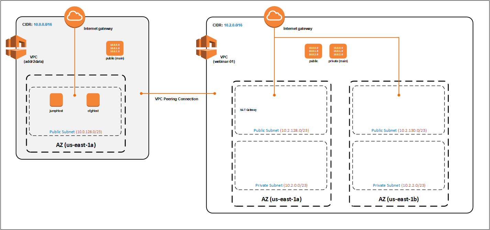
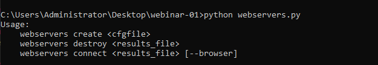
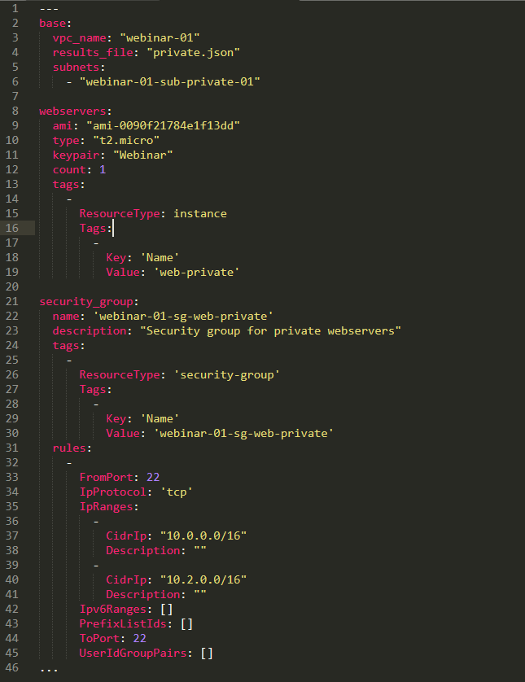
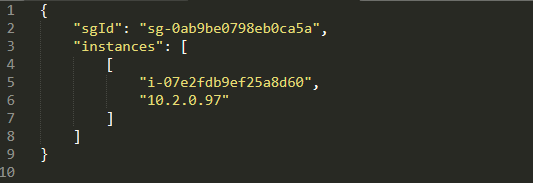
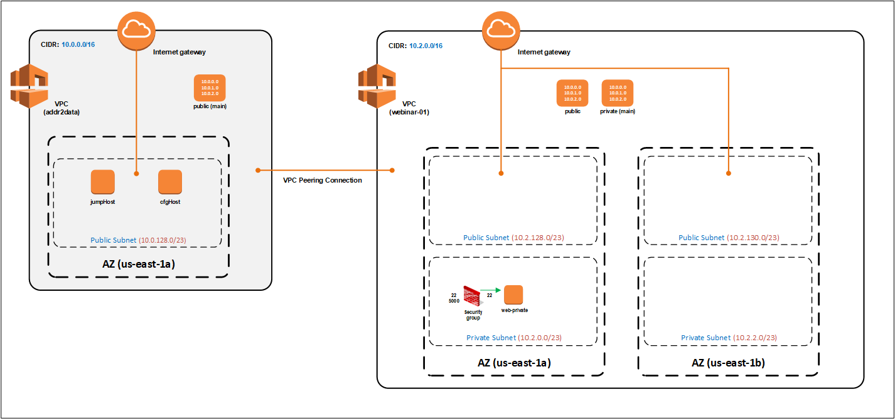

AWS Webinar Series
==================

Objectives
----------

- Expose attendees to significant number of AWS services over 4-5 webinars.

	+ Each webinar will build on the previous webinars

- Provide an opportunity to develop **hands-on-literacy** with AWS services, in three steps:

	+ **Introduce** - AWS services/components/concepts using the AWS console (**webinar**).

	+ **Do** - recreate what was built in the webinar using the awscli (**goingCmdO**).

	+ **Explore** - become familiar with using the AWS APIs directly (**code samples**)

- **NO SLIDES** - content is publicly available on GitHub.

	+ This session is available at **https://github.com/addr2data/webinar-01**.

|

Webinar-01
==========

Introduction
------------
During this webinar we will introduce the following AWS services/components/concepts:

- Virtual Private Cloud (VPC)
- Internet Gateways
- Routing Tables and Routes
- Subnets
- VPC Peering
- Security Groups
- Deploying instances via the API
- NAT (Network Address Translation) Gateways
- Elastic IP Addresses
- Application Load Balancers (ALB)
- Network Load Balancers (NLB) 

|

**We are going to cover a lot of ground in this webinar, some details will be glossed over and advanced topics will be skipped altogether.**

	| If you want the nitty-gritty, then join the **AWS Certified Advanced Networking Study Group** (see details below)

|

AWS Certified Advanced Networking Study Group
~~~~~~~~~~~~~~~~~~~~~~~~~~~~~~~~~~~~~~~~~~~~~
If you are looking for the nitty-gritty, then maybe the **AWS Certified Advanced Networking Study Group** is for you.

- Private channel on the **API Users** team in Microsoft Teams.
- Meets every Thu (5:00p -6:00p ET) starting Mar 4, 2021.
- Sessions will be recorded, for those in different regions (i.e. EMEA, APJ).
- Once you join, active participation is required. Either, during the weekly sessions or through the teams channel. 
- If you are interested, reach out to me via email or chat on teams. 

|

Notes for awscli
~~~~~~~~~~~~~~~~

- For parameters where the value is **static**, the specific **value** for this webinar is included.
- For parameters where the value is **dynamic**, and must be discovered, **<parameter>** is included.

|

****

****

Let's build something
---------------------

|

.. image:: ./images/webinar_net-01.png

|

****

****

Virtual Private Cloud (VPC)
---------------------------

The basics
~~~~~~~~~~

- VPCs are the networking layer for EC2.

- They are logically isolated sections of the AWS cloud.

- VPCs have the look and feel of traditional networks

	+ You define the address space (IPv4/IPv6)
	+ You configure subnets
	+ You configure routing tables
	+ You configure network gateways
	+ You apply security 

- VPCs are created per AWS Region

::

	What is an AWS Region?

	- A physical location where data centers are clustered.
	- Each AWS Region consists of multiple Availability Zones (AZ)
		- More on AZs when we get to Subnets
	- We will be working in the **us-east-1** Region
		- Located in Northern Virginia
		- Has six (6) AZs

|

- A VPC spans all AZs in a Region.

- When you create an account, a default VPC is created per region. This allows you to launch instances quickly without having to configure a VPC first.

- When you create a VPC, you must define an IPv4 CIDR block (/16 to /28).
	
	+ No matter what IPv4 CIDR block you use, Amazon treats these addresses as private.

- When you create a VPC, you can optionally define an IPv6 CIDR block (/56).
	
	+ This block can be Amazon or customer provided.

	+ Amazon treats these addresses as public.

- Once created, you can't change the initial IPv4 CIDR block, but you can add/remove other CIDR blocks.

- You can remove or replace your IPv6 CIDR block.

	+ You can't add more IPv6 CIDR blocks 

- VPCs can operate in dual-stack mode. You instances can communicate using IPv4, IPv6 or both.

- When you create a VPC, you must select a value for **Tenancy**.

	+ **Default:** The tenancy of instances is determined at launch.

	+ **Dedicated:** The tenancy of all instances launched in this VPC is dedicated. 

Quotas
~~~~~~

.. list-table::
   :widths: 25, 25
   :header-rows: 0

   * - **Component**
     - **Limit**
   * - VPC
     - 5 per region
   * - IPv4 CIDR blocks per VPC
     - 5
   * - IPv6 CIDR blocks per VPC
     - 1 ++

*++ Can't be increased*

Costs
~~~~~

- There are no charges directly associated with VPCs

toDoList
~~~~~~~~

- Create a VPC with the following parameters:

	+ Name-tag: **webinar-01**

	+ IPv4 CIDR block: **10.2.0.0/16**

	+ IPv4 CIDR block: **No IPv6 CIDR block**

	+ Tenancy: **Default** 

****

*goingCmdO*
~~~~~~~~~~~

Create a VPC

::

    aws ec2 create-vpc ^
    	--cidr-block 10.2.0.0/16 ^
    	--tag-specifications ResourceType=vpc,Tags=[{Key=Name,Value=webinar-01}]

|

The above awscli command will return the configuration of the newly created VPC. The output will include the **vpcId**, which will be required for future operations. Here's one way to return just the **vpcId**, as text, from the awscli.

::

	aws ec2 describe-vpcs ^
		--filters Name=tag:Name,Values=webinar-01 ^
		--query Vpcs[].VpcId --output text

|

****

****

Internet Gateway
-----------------

The basics
~~~~~~~~~~

- A VPC component that allows communication between your VPC and the Internet.

- Internet Gateways are highly-available and scalable.

- Provides a target for Internet routable traffic in your VPC route tables (i.e. default route)

- Supports both IPv4 and IPv6

- Performs Network Address Translation (NAT) for IPv4

- You can have one (1) Internet Gateway per VPC. 

Quotas
~~~~~~

.. list-table::
   :widths: 25, 25
   :header-rows: 0

   * - **Component**
     - **Limit**
   * - Internet Gateways
     - 5 per region ++

*++ Directly associated with the 'VPCs per region' quota.*

Costs
~~~~~

- There are no charges directly associated with Internet Gateways

toDoList
~~~~~~~~

- Create an Internet Gateway named **webinar-01-igw**.
- Attach it to the **webinar-01** VPC

****

*goingCmdO*
~~~~~~~~~~~

Create an Internet Gateway

::

	aws ec2 create-internet-gateway ^
		--tag-specifications ResourceType=internet-gateway,Tags=[{Key=Name,Value=webinar-01-igw}]

|

The above awscli command will return the configuration of the newly created Internet Gateway. The output will include the
**InternetGatewayId**, which will be required for future operations. Here's one way to return just the **InternetGatewayId**,
as text, from the awscli.

::

	aws ec2 describe-internet-gateways ^
		--filters Name=tag:Name,Values=webinar-01-igw ^
		--query InternetGateways[].InternetGatewayId ^
		--output text

|

Attach the Internet Gateway to a VPC.

::

	aws ec2 attach-internet-gateway ^
		--internet-gateway-id <InternetGatewayId> ^
		--vpc-id <vpcId>

|

****

****

Route Tables and Routes
-----------------------

The basics
~~~~~~~~~~

- A VPC component that contains a set of routes that determine where network traffic is directed within your VPC.

- One (1) route table is automatically created when you create a VPC. By default, it's the  **main** route table.

- You can create your own route tables.

- Subnets are associated with route tables, either explicitly or implicitly.

- Any subnet not explicitly associated with a route table, is implicitly associated with the **main** route table.

- A route table defines the routing for any subnet associated with it. 

- You can change which route table is the **main** route table.

- IPv4 and IPv6 is handled separately.

- Each route has a **destination** and a **target**.

	+ The IPv4 default route associated with your *public* subnets, may look like this:

		+ Destination: **0.0.0.0/0**

		+ Target: **igw-xxxxxxxxxxxxxxxxx**

	+ Every route table has an IPv4 local route automatically added to it, for routing IPv4 traffic within a VPC:

		+ Destination: **10.2.0.0/16** (or whatever your VPC IPv4 CIDR block is)

		+ Target: **local**

	+ If you have enabled IPv6, then every route table will also have an IPv6 local route automatically added to it:

		+ Destination: **2600:1f18:a1c:b300::/56** (or whatever your VPC IPv6 CIDR block is)

		+ Target: **local**

- When a route table has multiple routes, the most specific route (longest prefix) that matches the traffic, determines how traffic is routed.

Quotas
~~~~~~

.. list-table::
   :widths: 25, 25
   :header-rows: 0

   * - **Component**
     - **Limit**
   * - Route tables per VPC
     - 200
   * - Routes per route table (non-propagated routes)
     - 50
   * - BGP advertised routes per route table (propagated routes)
     - 100 ++

*++ Propagation is beyond the scope of this webinar.*

Costs
~~~~~

- There are no charges directly associated with Route Tables

toDoList
~~~~~~~~

- Review the **main** route table.

- Add a name-tag **webinar-01-rt-private** to the main route table .

- Create a second route table, using the name-tag **webinar-01-rt-public**.

- Add a **default route** to the **webinar-01-rt-public** route table.

****

*goingCmdO*
~~~~~~~~~~~

Examine the main route table.

::

	aws ec2 describe-route-tables ^
		--filters "Name=vpc-id,Values=<vpc-id>"

|

The above awscli command will return the configuration of the automatically created Route Table. The output will include the
**RouteTableId**, which will be required for future operations. Here's one way to return just the **RouteTableId**,
as text, from the awscli.

::

	aws ec2 describe-route-tables ^
		--filters "Name=vpc-id,Values=<vpc-id>" ^
		--query RouteTables[].RouteTableId ^
		--output text

|

Add a name-tag **webinar-01-rt-private** to the **main** route table .

::

	aws ec2 create-tags ^
		--resources <route-table-id> ^
		--tags Key=Name,Value=webinar-01-rt-private

|

Create a second route table, using the name-tag **webinar-01-rt-public**

::

	aws ec2 create-route-table ^
		--vpc-id <vpc-id> ^
		--tag-specifications ResourceType=route-table,Tags=[{Key=Name,Value=webinar-01-rt-public}]

|

Add a default route to the **webinar-01-rt-public** route table.

::

	aws ec2 create-route ^
		--destination-cidr-block 0.0.0.0/0 ^
		--gateway-id <igw-id> ^
		--route-table-id <rtb-id>

|

****

****

Subnets
-------

The basics
~~~~~~~~~~

- When you create a Subnet in a VPC:

	+ You must specify an AZ within the associated Region.

	+ You must specify a IPv4 CIDR block within the IPv4 CIDR block of the VPC.

	+ If the VPC has an IPv6 CIDR block defined, then you can optionally define an IPv6 CIDR block for the Subnet

::

	What is an AWS Availability Zone (AZ)?

	- An AZ consists of one or more data centers
	- These data centers have redundant power, networking and connectivity.
	- AZs are physically separated by many kilometers. 
	- Customers who operate applications across AZs are able to achieve higher levels of availability.
	- The two (2) AZs that we will use during this webinar are us-east-1a and us-east-1b

|

- Each Subnet has five (5) addresses reserved from its IPv4 CIDR block.

	+ For example, our Subnets will use IPv4 CIDR blocks with a prefix length of **/23**, which results in **512** possible IPv4 addresses, but only **507** IPv4 addresses available for Instances.

	+ The reserved addresses are as follows:

		+ base + 0: Network address

		+ base + 1: Reserved by AWS (VPC router)

		+ base + 2: Reserved by AWS (VPC base + 2 is DNS server, but base + 2 is also reserved in each subnet)

		+ base + 3: Reserved by AWS (future use)

		+ last: Broadcast address

- If traffic for a particular Subnet can be routed to an Internet Gateway (based on the Route Table association), then it is considered to be a *public* subnet.

- For an Instance on a *public* subnet to communicate over the Internet with IPv4, it must have a *Public IPv4 address* or an *Elastic IP address*.

	+ More on *Public IPv4 addresses* and *Elastic IP addresses* later  

- Subnets have a setting called **Auto-assign IPv4**, which can be enabled/disabled. If this setting is enabled for a subnet:

	+ Instances launched in that Subnet will be assigned a *Public IPv4 address*, unless overridden during Instance launch. 

- For an Instance on a *public* subnet to communicate over the Internet with IPv6, it must have an IPv6 address.

- If traffic for a particular Subnet can not be routed to an Internet Gateway (based on the Route Table association), then it is considered to be a *private* subnet.

Quotas
~~~~~~

.. list-table::
   :widths: 25, 25
   :header-rows: 0

   * - **Component**
     - **Limit**
   * - Subnets per VPC
     - 200

Costs
~~~~~

- There are no charges directly associated with Subnets

toDoList
~~~~~~~~

- Create four (4) subnets using the following parameters:

.. list-table::
   :widths: 25, 25, 25
   :header-rows: 0

   * - **Name-tag**
     - **Availability Zone**
     - **IPv4 CIDR**
   * - `webinar-01-sub-private-01`
     - `us-east-1a`
     - `10.2.0.0/23`
   * - `webinar-01-sub-private-02`
     - `us-east-1b`
     - `10.2.2.0/23`
   * - `webinar-01-sub-public-01`
     - `us-east-1a`
     - `10.2.128.0/23`
   * - `webinar-01-sub-public-02`
     - `us-east-1b`
     - `10.2.130.0/23`

|

- Review the four (4) subnets that we just created.

- Associate **webinar-01-sub-public-01** and **webinar-01-sub-public-02** with **webinar-01-rt-public**

- Review the association in **webinar-01-rt-public**

****

*goingCmdO*
~~~~~~~~~~~

Create four (4) subnets

::

	aws ec2 create-subnet ^
		--cidr-block 10.2.0.0/23 ^
		--vpc-id <vpcId> ^
		--availability-zone us-east-1a ^
		--tag-specifications ResourceType=subnet,Tags=[{Key=Name,Value=webinar-01-sub-private-01}]

	aws ec2 create-subnet ^
		--cidr-block 10.2.2.0/23 ^
		--vpc-id <vpcId> ^
		--availability-zone us-east-1b ^
		--tag-specifications ResourceType=subnet,Tags=[{Key=Name,Value=webinar-01-sub-private-02}]

	aws ec2 create-subnet ^
		--cidr-block 10.2.128.0/23 ^
		--vpc-id <vpcId> ^
		--availability-zone us-east-1a ^
		--tag-specifications ResourceType=subnet,Tags=[{Key=Name,Value=webinar-01-sub-public-01}]

	aws ec2 create-subnet ^
		--cidr-block 10.2.130.0/23 ^
		--vpc-id <vpcId> ^
		--availability-zone us-east-1b ^
		--tag-specifications ResourceType=subnet,Tags=[{Key=Name,Value=webinar-01-sub-public-02}]

|

Review the the four (4) subnets created above.

::

	aws ec2 describe-subnets ^
		--filters "Name=vpc-id,Values=<vpc-id>"

|

Show the **Name** and **SubnetId** of the four (4) Subnets in a table.

::

	aws ec2 describe-subnets ^
		--filters "Name=vpc-id,Values=<vpcId>" ^
		--query "Subnets[*].{name: Tags[?Key=='Name'] | [0].Value, Id: SubnetId}" --output table --color off

	-----------------------------------------------------------
	|                     DescribeSubnets                     |
	+---------------------------+-----------------------------+
	|            Id             |            name             |
	+---------------------------+-----------------------------+
	|  subnet-06d45e8022909b538 |  webinar-01-sub-private-01  |
	|  subnet-0a89f3ebc7a958154 |  webinar-01-sub-public-02   |
	|  subnet-057041e32aad58f18 |  webinar-01-sub-private-02  |
	|  subnet-085968550caaec8d7 |  webinar-01-sub-public-01   |
	+---------------------------+-----------------------------+

|

Associate **webinar-01-sub-public-01** and **webinar-01-sub-public-02** with **webinar-01-rt-public**

::

	aws ec2 associate-route-table ^
		--route-table-id <RouteTableId> ^
		--subnet-id <SubnetId>

|

Review the associations in **webinar-01-rt-public**.

::

	aws ec2 describe-route-tables ^
		--filters "Name=vpc-id,Values=vpc-0728135c72ee58885"

|

****

****

VPC peering
-----------

The basics
~~~~~~~~~~

- VPC peering allows you to create a network connection (VPC peering connection) between two VPCs.

- Traffic can be routed between VPCs, using private IPv4 address or IPv6 addresses.

- A VPC peering connection can be created between:

	+ Two VPCs in the same AWS account

	+ Two VPCs in different AWS accounts

	+ Two VPCs in different Regions (aka inter-region VPC peering connection).

Quotas
~~~~~~

.. list-table::
   :widths: 25, 25
   :header-rows: 0

   * - **Component**
     - **Limit**
   * - Active VPC peering connections per VPC
     - 50
   * - Outstanding VPC peering connection requests
     - 25
   * - Expiry time for an unaccepted VPC peering connection request
     - 168 hours (1 week)

Costs
~~~~~

- There are no charges directly associated with VPC peering.

toDoList
~~~~~~~~

- Create a VPC peering connection named **webinar-01-pcx** between **webinar-01** (requester) and **addr2data** VPCs (acceptor).

- Accept the VPC peering connection

- Add the following route to **webinar-01-rt-public**

.. list-table::
   :widths: 25, 25
   :header-rows: 0

   * - **Destination**
     - **Target**
   * - `10.0.0.0/16`
     - `<VpcPeeringConnectionId>`

- Add the following route to **webinar-01-rt-private**

.. list-table::
   :widths: 25, 25
   :header-rows: 0

   * - **Destination**
     - **Target**
   * - `10.0.0.0/16`
     - `<VpcPeeringConnectionId>`

- Add the following route to **addr2data-rt-public**

.. list-table::
   :widths: 25, 25
   :header-rows: 0

   * - **Destination**
     - **Target**
   * - `10.2.0.0/16`
     - `<VpcPeeringConnectionId>`

****

*goingCmdO*
~~~~~~~~~~~

Create a VPC peering connection between **webinar-01** (requester) and **addr2data** (acceptor)

::

	aws ec2 create-vpc-peering-connection ^
		--peer-vpc-id <vpcId> ^
		--vpc-id <vpcId> ^
		--tag-specifications ResourceType=vpc-peering-connection,Tags=[{Key=Name,Value=webinar-01-peerlink}]

|

Accept the VPC peering connection

::

	aws ec2 accept-vpc-peering-connection ^
		--vpc-peering-connection-id <VpcPeeringConnectionId>

|

Add the following route to **webinar-01-rt-public**

::

	aws ec2 create-route ^
		--destination-cidr-block 10.0.0.0/16 ^
		--gateway-id <VpcPeeringConnectionId> ^
		--route-table-id <RouteTableId>

|

Add the following route to **webinar-01-rt-private**

::

	aws ec2 create-route ^
		--destination-cidr-block 10.0.0.0/16 ^
		--gateway-id <VpcPeeringConnectionId> ^
		--route-table-id <RouteTableId>

|

Add the following route to **addr2data-rt-public**

::

	aws ec2 create-route ^
		--destination-cidr-block 10.2.0.0/16 ^
		--gateway-id <VpcPeeringConnectionId> ^
		--route-table-id <RouteTableId>

|

****

****

Let's review where we are at
----------------------------

|

|

Security Groups
---------------

The basics
~~~~~~~~~~

- Security Groups act as a virtual firewall for your EC2 instances.

	+ Inbound rules control the incoming traffic to your instance.

	+ Outbound rules control the outgoing traffic from your instance.

- When you launch an instance in a VPC, you specify one or more security groups from that VPC.

	+ If you don't, then the default security group will be used.

- You can modify the rules in a Security Group at any time.

- New and modified rules are automatically applied to all instances that are associated with the security group.

Quotas
~~~~~~

.. list-table::
   :widths: 25, 25
   :header-rows: 0

   * - **Component**
     - **Limit**
   * - VPC security groups per Region
     - 2500
   * - Inbound rules per security group
     - 60 (1,2,4)
   * - Outbound rules per security group
     - 60 (1,2,4)
   * - Security groups per network interface
     - 5 (1,3,4)

- *(1) This quota is enforced separately for IPv4 and IPv6*

- *(2) Referencing another security counts as one rule*

- *(3) The maximum is 16*

- *(4) The quota for security groups per network interface multiplied by the quota for rules per security group cannot exceed 1000*

Costs
~~~~~

- There are no charges directly associated with Security Groups

|

****

****

Instances
~~~~~~~~~

The basics
~~~~~~~~~~

- Reasonable coverage of EC2 Instances would require an entire webinar.

- Let it suffice to say that Instances are virtual machines.

Quotas
~~~~~~

.. list-table::
   :widths: 25, 25
   :header-rows: 0

   * - **Component**
     - **Limit**
   * - Network interfaces per instance
     - Varies per Instance Type (1,2)
   * - Network interfaces per Region
     - 5000

- *(1) For Instance Type t2.micro the limit is 2*

- *(2) For Instance Type t2.medium the limit is 3*

Costs
~~~~~

- Charges for Instances are based on Instance Type and Reservation Type.

|

****

****

Test Connectivity
-----------------

The basics
~~~~~~~~~~

- We will deploy one (1) Instance to a *private* Subnet and test connectivity.

- We will use the **webservers.py** script.

	+ Uses **boto3** (AWS SDK for Python)

|

What parameters does **webservers.py** take?

|

Before we run **webserver.py**, let's examine the **<cfgfile>** that will be used.

	+ **cfg-private.yml**

|

Here is a summary of what **webserver.py create cfg-private.yml** will do.

- Create a security group named **webinar-01-sg-web-private**

- Add an ingress rule to **webinar-01-sg-web-private** that allows **SSH** traffic from **10.0.0.0/16** and **10.2.0.0/16** 

- Launch a single instance, using the following parameters:

	+ AMI: **base_webserver** (a simple web server starts on boot - port 5000)
	
	+ Network: **webinar-01**
	
	+ Subnet: **webinar-01-sub-private-01**
	
	+ Security Groups: **webinar-01-sg-web-private**
	
	+ Tags: *Key* = **Name**, *Value* = **web-private**

- Write some details to **output_file** (private.json).

|

Let's examine **private.json**.

|

toDoList
~~~~~~~~

- From **jumpHost**, run the following command to create the Security Group and the Instance.

::

	python webservers.py create cfg-private.yml

- From **jumpHost**, run the following command to connect to **web-private** via SSH.

::

	python webservers.py connect private.json

- From **jumpHost**, run the following command to browse to http://**<web-private>**:5000.

::

	python webservers.py connect private.json --browser

|

Why did the last command fail?

|

- Add a rule to allow TCP 5000 from **10.0.0.0/16** and **10.2.0.0/16** to security group **webinar-01-sg-web-private**

|

- From **jumpHost**, run the following command to browse to **http://<web-private>:5000**.

::

	python webservers.py connect private.json --browser

- From **web-private**, run the following command.

::

	ping www.google.com

*goingCmdO*
~~~~~~~~~~~

Create a security group.

::

	aws ec2 create-security-group ^
		--group-name webinar-01-sg-web-private ^
		--description "Allow SHH from anywhere" --vpc-id <vpc-id>

|

Add a rule to the security group to allow SSH from **10.0.0.0/16**.

::

	aws ec2 authorize-security-group-ingress ^
		--group-id <GroupId> ^
		--protocol tcp ^
		--port 22 ^
		--cidr 10.0.0.0/16

|

Add a rule to the security group to allow SSH from **10.2.0.0/16**.

::

	aws ec2 authorize-security-group-ingress ^
		--group-id <GroupId> ^
		--protocol tcp ^
		--port 22 ^
		--cidr 10.2.0.0/16

|

Launch a single instance.

::

	aws ec2 run-instances ^
		--image-id ami-0090f21784e1f13dd ^
		--instance-type t2.micro ^
		--key-name web-private ^
		--subnet-id <SubnetId> ^
		--security-group-ids <GroupId> ^
		--tag-specifications ResourceType=instance,Tags=[{Key=Name,Value=web-public}]

|

Add a rule to the security group to allow TCP port 5000 from **10.0.0.0/16**.

::

	aws ec2 authorize-security-group-ingress ^
		--group-id <GroupId> ^
		--protocol tcp ^
		--port 5000 ^
		--cidr 10.0.0.0/16

|

Add a rule to the security group to allow TCP port 5000 from **10.2.0.0/16**.

::

	aws ec2 authorize-security-group-ingress ^
		--group-id <GroupId> ^
		--protocol tcp ^
		--port 5000 ^
		--cidr 10.2.0.0/16

|

****

****

Elastic IP addresses vs. Public IPv4 addresses
----------------------------------------------

The basics
~~~~~~~~~~

- An Elastic IP address is a static Internet routable IPv4 address.

- An Elastic IP address is allocated to your AWS account, and is yours until you release it. 

- Elastic IP addresses are not currently supported for IPv6.

- Elastic IP addresses can be associate it with your instance or a network interface.

	+ When you associate it with an Instance it is associated with the primary network interface.

- When you associate an Elastic IP address with a network interface that is attached to an instance, it is also associated with the instance.

- When you associate an Elastic IP address with an instance or its primary network interface, the instance's public IPv4 address (if it had one) is released back into Amazon's pool of public IPv4 addresses. You cannot reuse a public IPv4 address, and you cannot convert a public IPv4 address to an Elastic IP address. For more information, see Public IPv4 addresses and external DNS hostnames.

- You can disassociate an Elastic IP address from a resource, and then associate it with a different resource.

- A disassociated Elastic IP address remains allocated to your account until you explicitly release it.

- When you associate an Elastic IP address with an instance that previously had a public IPv4 address, the public DNS host name of the instance changes to match the Elastic IP address.

- We resolve a public DNS host name to the public IPv4 address or the Elastic IP address of the instance outside the network of the instance, and to the private IPv4 address of the instance from within the network of the instance.

- An Elastic IP address comes from Amazon's pool of IPv4 addresses, or from a custom IP address pool that you have brought to your AWS account.

- When you allocate an Elastic IP address from an IP address pool that you have brought to your AWS account, it does not count toward your Elastic IP address limits.

- An Elastic IP address is for use in a specific Region only, and cannot be moved to a different Region.

Quotas
~~~~~~

.. list-table::
   :widths: 25, 25
   :header-rows: 0

   * - **Component**
     - **Limit**
   * - Elastic IP addresses per Region
     - 5

Costs
~~~~~

- There is no charge for Elastic IP addresses or Public IPv4 address that are in use.

- There is a charges of **$0.005** per hour for Elastic IP address that allocated, but not in use by a running Instance. 

toDoList
~~~~~~~~

- Allocate an Elastic IP address

*goingCmdO*
~~~~~~~~~~~

::

	aws ec2 allocate-address ^
		--domain vpc

|

****

****

Nat Gateway
-----------

The basics
~~~~~~~~~~

- NAT (Network Address Translation) Gateways allow instances on a private subnet to connect to the Internet or other AWS services, but prevent the Internet from initiating a connection with those instances.

- NAT gateways are not supported for IPv6 traffic
	+  Egress-only Internet Gateways can be used instead.

- When you create a NAT gateway, you specify the *public* subnet in which the NAT gateway will reside. 

- You must also specify an Elastic IP address to associate with the NAT gateway when you create it.

- The Elastic IP address cannot be changed after you associate it with the NAT Gateway.

- After you've created a NAT gateway, you must update the route table associated with one or more of your private subnets to point internet-bound traffic to the NAT gateway.

- Each NAT gateway is created in a specific Availability Zone and implemented with redundancy in that zone.

- A NAT gateway supports 5 Gbps of bandwidth and automatically scales up to 45 Gbps. If you require more, you can distribute the workload by splitting your resources into multiple subnets, and creating a NAT gateway in each subnet.

- You can associate exactly one Elastic IP address with a NAT gateway.

- A NAT gateway supports the following protocols: TCP, UDP, and ICMP.

- You cannot associate a security group with a NAT gateway. You can use security groups for your instances in the private subnets to control the traffic to and from those instances.

- You can use a network ACL to control the traffic to and from the subnet in which the NAT gateway is located. The network ACL applies to the NAT gateway's traffic. A NAT gateway uses ports 1024–65535.

- You cannot route traffic to a NAT gateway through a VPC peering connection, a Site-to-Site VPN connection, or AWS Direct Connect. A NAT gateway cannot be used by resources on the other side of these connections.

- A NAT gateway can support up to 55,000 simultaneous connections to each unique destination. This limit also applies if you create approximately 900 connections per second to a single destination (about 55,000 connections per minute). If the destination IP address, the destination port, or the protocol (TCP/UDP/ICMP) changes, you can create an additional 55,000 connections. For more than 55,000 connections, there is an increased chance of connection errors due to port allocation errors. These errors can be monitored by viewing the ErrorPortAllocation CloudWatch metric for your NAT gateway. For more information, see Monitoring NAT gateways using Amazon CloudWatch.

Quotas
~~~~~~

.. list-table::
   :widths: 25, 25
   :header-rows: 0

   * - **Component**
     - **Limit**
   * - NAT gateways per Availability Zone
     - 5

Costs
~~~~~

- You are billed **$0.045** per hour for a NAT Gateway.

- You are billed **$0.045** per GB for data processed by a NAT Gateway.

toDoList
~~~~~~~~

- Deploy NAT Gateway named **webinar-01-nat**

- Add a default route to the **webinar-01-rt-private** route table, using the NAT gateway as the target.

- From **web-private**, run the following command.

::

	ping www.google.com

*goingCmdO*
~~~~~~~~~~~

::

	aws ec2 create-nat-gateway ^
		--allocation-id <AllocationId> ^
		--subnet-id <SubnetId>

|

Add a default route to the **webinar-01-rt-private** route table, using the NAT gateway as the taget.

::

	aws ec2 create-route ^
		--destination-cidr-block 0.0.0.0/0 ^
		--nat-gateway-id <NatGatewayId> ^
		--route-table-id <RouteTableId>

|

****

****

Load Balancers
--------------

Application Load Balancers
~~~~~~~~~~~~~~~~~~~~~~~~~~

- Operates at Layer-7

- Load balances HTTP and HTTPS traffic

- Supports TLS Offloading

- Supports sticky sessions

- Native IPv6 Support

- Supports Security Groups

Network Load Balancers
~~~~~~~~~~~~~~~~~~~~~~

- Operates at layer 4.

- Load balances TCP and UDP traffic.

- Supports TLS offloading

- Supports sticky sessions

- Low Latency

- Preserves source IP address

- Supports long-lived TCP connections

Quotas (Regional)
~~~~~~~~~~~~~~~~~

.. list-table::
   :widths: 25, 25
   :header-rows: 0

   * - **Component**
     - **Limit**
   * - Load balancers per Region
     - 50
   * - Target groups per Region
     - 3000
   * - ENIs per VPC (NLB)
     - 300

Quotas (Load balancer)
~~~~~~~~~~~~~~~~~~~~~~

.. list-table::
   :widths: 25, 25
   :header-rows: 0

   * - **Component**
     - **Limit**
   * - Listeners per load balancer
     - 50
   * - Targets per load balancer (NLB)
     - 3000
   * - [Cross-zone load balancing disabled] Targets per Availability Zone per load balancer (NLB)
     - 500
   * - [Cross-zone load balancing enabled] Targets per load balancer (NLB)
     - 500
   * - Targets per load balancer (ALB)
     - 1000
   * - Target groups per load balancer (ALB)
     - 100
   * - Subnets per Availability Zone per load balancer
     - 1
   * - Security groups per load balancer (ALB)
     - 5
   * - Rules per load balancer (not counting default rules) (ALB)
     - 100
   * - Certificates per load balancer (not counting default certificates)
     - 25

Quotas (Target groups)
~~~~~~~~~~~~~~~~~

.. list-table::
   :widths: 25, 25
   :header-rows: 0

   * - **Component**
     - **Limit**
   * - Load balancers per target group
     - 1
   * - Targets per target group
     - 1000

Costs
~~~~~

- Load balancer charges (NLB and ALB)

	+ $0.0225 per Application Load Balancer-hour (or partial hour)

- LCU charges (ALB)

	+ $0.008 per LCU-hour (or partial hour)

- NLCU charges (NLB)

	+ $0.006 per NLCU-hour (or partial hour)

toDoList
~~~~~~~~

- From **jumpHost**, run the following command to create a Security Group and four (4) Instances.

::

	python webservers.py create cfg-public.yml

|

- Create an Application Load-balancer with the following settings

	+ Basic Configuration

		+ name: **webinar-01-lb-app**

		+ IP address type: ipv4

	+ Listeners

		+ Load Balancer Protocol: **HTTP**

		+ Load Balancer Port: **5000**

	+ Availability Zones

		+ VPC: **webinar-01**

		+ Availability Zones

			us-east-1a: **webinar-01-sub-public-01**

			us-east-1b: **webinar-01-sub-public-02**

	+ Configure Security Groups

		+ Assign a security group: **Create a new security group**

		+ Security group name: **webinar-01-sg-lb-app**

		+ Description : **Security group for application load Balancer**

		+ Rule

			Type: **Custom TCP Rule**

			Protocol: **TCP**

			Port Range: **5000**

			Source: **Custom 0.0.0.0/0**

	+ Configure Routing

		+ Target group

			Target group: **New target group**

			Name: **webinar-01-tg-app**

			Target type: **Instance**

			Protocol: **HTTP**

			Port: **5000**

			Protocol version: **HTTP1**

		+ Health checks

			Protocol: **HTTP**

			Path: **/**

	+ Register Targets

		+ Instances

			Select **all**

			Click **Add to registered**

|

- Create an Network Load-balancer with the following settings

	+ Basic Configuration

		+ name: **webinar-01-lb-net**

		+ IP address type: ipv4

	+ Listeners

		+ Load Balancer Protocol: **HTTP**

		+ Load Balancer Port: **5000**

	+ Availability Zones

		+ VPC: **webinar-01**

		+ Availability Zones

			us-east-1a: **webinar-01-sub-public-01**

			us-east-1b: **webinar-01-sub-public-02**

	+ Configure Routing

		+ Target group

			Target group: **New target group**

			Name: **webinar-01-tg-net**

			Target type: **Instance**

			Protocol: **TCP**

			Port: **5000**

		+ Health checks

			Protocol: **TCP**

	+ Register Targets

		+ Instances

			Select **all**

			Click **Add to registered**

*goingCmdO*
~~~~~~~~~~~

::

	aws elbv2 create-load-balancer ^
		--name webinar-01-lb-app ^
		--scheme internet-facing ^
		--type application ^
		--ip-address-type ipv4 ^
		--subnets <SubnetId> <SubnetId> ^
		--security-groups <SecurityGroupId>

|

****

****
