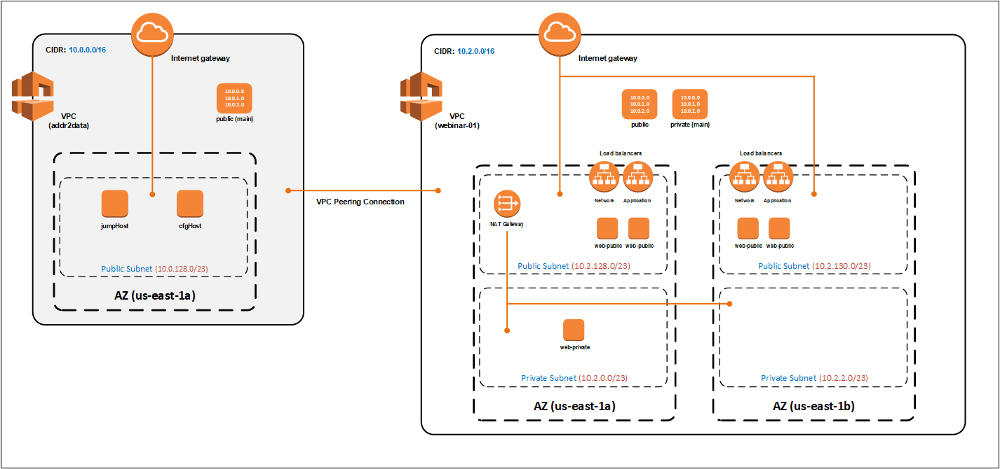

Webinar-01
==========

Introduction
------------
When getting started with AWS or learning and learning a new service), I have found that the following approach works well for me. Hopefully, it will work well for you.

- Use the AWS console, then
- Use the awscli, then
- Use the API directly, via a scripting language (e.g. Python)

|

During this webinar we will be using the AWS console, but I have also provided equivalent awscli commands for each operation.

*If the awscli is for you, then read the 'Notes or awscli' section*

|

We are going to cover a lot of ground in this webinar, some details will be glossed over and advanced topics will be skipped altogether.

*If you want the nitty-gritty, the read the 'AWS Certified Advanced Networking Study Group' section*

|

**NO SLIDES** - all this content is publicly available on GitHub **https://github.com/addr2data/webinar-01**

Notes for awscli
~~~~~~~~~~~~~~~~

- For parameters where the value is **static**, the specific **value** for this webinar is included.
- For parameters where the value is **dynamic**, and must be discovered, **<parameter>** is included.

AWS Certified Advanced Networking Study Group
~~~~~~~~~~~~~~~~~~~~~~~~~~~~~~~~~~~~~~~~~~~~~
If you are looking for the nitty-gritty, then maybe the **AWS Certified Advanced Networking Study Group** is for you.

- Private channel on the **API Users** team in Microsoft Teams.
- Meets every Thu (5:00p -6:00p ET) starting Mar 4, 2021.
- Sessions will be recorded, if the time is not convenient (EMEA, APJ, etc.).
- Participation is mandatory.
- If you are interested, reach out to me via email or chat on teams. 

|

****

****

Let's build something
---------------------

|

|

****

****

Amazon Virtual Private Cloud (VPC)
----------------------------------
VPCs are logically isolated sections of the AWS cloud.

- VPCs have the look and feel of traditional networks

	+ You can define the IPv4/IPv6 address space
	+ You can create subnets
	+ YOu can configure routing tables 

*Note: there are no charges associated with VPCs*

toDoList
~~~~~~~~

- Create a VPC named **webinar-01** with a CIDR of **10.2.0.0/16**. 

****

*goingCmdO*
~~~~~~~~~~~

awscli::

    $ aws ec2 create-vpc --cidr-block 10.2.0.0/16 --tag-specifications ResourceType=vpc,Tags=[{Key=Name,Value=webinar-01}]

|

The above awscli command will return the configuration of the newly created VPC. The output will include the **vpcId**, which will be required for future operations. Here's one way to return just the **vpcId**, as text, from the awscli.

awscli::
	
	$ aws ec2 describe-vpcs --filters Name=tag:Name,Values=webinar-01 --query Vpcs[].VpcId --output text

|

****

****

Internet Gateway
-----------------
A VPC component that allows communication between your VPC and the Internet. It is highly-available and scalable.

- Provides a target for Internet routable traffic in your VPC route tables (i.e. default route)
- Performs Network Address Translation (NAT) for IPv4
- Supports both IPv4 and IPv6

*Note: there are no charges associated with Internet Gateways*

toDoList
~~~~~~~~

- Create an Internet Gateway named **webinar-01-igw**.
- Attach it to our VPC

****

*goingCmdO*
~~~~~~~~~~~

awscli::

	aws ec2 create-internet-gateway --tag-specifications ResourceType=internet-gateway,Tags=[{Key=Name,Value=webinar-01-igw}]

|

The above awscli command will return the configuration of the newly created Internet Gateway. The output will include the
**InternetGatewayId**, which will be required for future operations. Here's one way to return just the **InternetGatewayId**,
as text, from the awscli.

awscli::
	
	$ aws ec2 describe-internet-gateways --filters Name=tag:Name,Values=webinar-01-igw --query InternetGateways[].InternetGatewayId --output text

|

awscli::

	aws ec2 attach-internet-gateway --internet-gateway-id <igw-id> --vpc-id <vpc-id>

|

****

****

Route Tables and Routes
-----------------------
A VPC component that contains a set of routes. These routes determine where network traffic is directed within your VPC.

- A route table that automatically comes with your VPC. It is called the **main** route table.
- You can create your own **custom** route tables.
- Subnets are associated with route tables, either explicitly or implicitly.
- Any subnet not explicitly associated with a **custom** route table, is implicitly associated with the **main** route table 

*Note: there are no charges associated with route tables or routes*

toDoList
~~~~~~~~

- Review the **main** route table.
- Name main route table **webinar-01-rt-private**.
- Create a **custom** route table named **webinar-01-rt-public** .
- Add a **default route** to the **webinar-01-rt-public** route table.

****

*goingCmdO*
~~~~~~~~~~~

First, let's examine the main route table.

awscli::

	aws ec2 describe-route-tables --filters "Name=vpc-id,Values=<vpc-id>"

|

The above awscli command will return the configuration of the automatically created Route Table. The output will include the
**RouteTableId**, which will be required for future operations. Here's one way to return just the **RouteTableId**,
as text, from the awscli.

awscli::

	aws ec2 describe-route-tables --filters "Name=vpc-id,Values=<vpc-id>" --query RouteTables[].RouteTableId --output text

|

Next, we are going name the main route table **webinar-01-rt-private**.

awscli::

	aws ec2 create-tags --resources <route-table-id> --tags Key=Name,Value=webinar-01-rt-private

|

Next, we are going create a custom route table named **webinar-01-rt-public**

awscli::

	aws ec2 create-route-table --vpc-id <vpc-id> --tag-specifications ResourceType=route-table,Tags=[{Key=Name,Value=webinar-01-rt-public}]

|

Finally, we are going to add a default route to the **webinar-01-rt-public** route table.

awscli::

	aws ec2 create-route --destination-cidr-block 0.0.0.0/0 --gateway-id <igw-id> --route-table-id <rtb-id>

|

****

****

Subnets
-------
Subnets are

*Note: there are no charges associated with subnets*

toDoList
~~~~~~~~

- Create a subnet in availability zone **us-east-1a** named **webinar-01-sub-private-01**, using cidr **10.2.128.0/23**
- Create a subnet in availability zone **us-east-1a** named **webinar-01-sub-public-01**, using cidr **10.2.0.0/23**
- Create a subnet in availability zone **us-east-1b** named **webinar-01-sub-private-02**, using cidr **10.2.130.0/23**
- Create a subnet in availability zone **us-east-1b** named **webinar-01-sub-public-02**, using cidr **10.2.2.0/23**
- Review the subnets just created.
- Review the association in the **public** route table

****

*goingCmdO*
~~~~~~~~~~~

First, let's create some subnets

awscli::

	aws ec2 create-subnet --cidr-block 10.2.128.0/23 --vpc-id <vpcId> --availability-zone us-east-1a --tag-specifications ResourceType=subnet,Tags=[{Key=Name,Value=webinar-01-sub-private-01}]

	aws ec2 create-subnet --cidr-block 10.2.0.0/23 --vpc-id <vpcId> --availability-zone us-east-1a --tag-specifications ResourceType=subnet,Tags=[{Key=Name,Value=webinar-01-sub-public-01}]

	aws ec2 create-subnet --cidr-block 10.2.130.0/23 --vpc-id <vpcId> --availability-zone us-east-1b --tag-specifications ResourceType=subnet,Tags=[{Key=Name,Value=webinar-01-sub-private-02}]

	aws ec2 create-subnet --cidr-block 10.2.2.0/23 --vpc-id <vpcId> --availability-zone us-east-1b --tag-specifications ResourceType=subnet,Tags=[{Key=Name,Value=webinar-01-sub-public-02}]

|

Next, let's review the subnet configuration.

awscli::

	aws ec2 describe-subnets --filters "Name=vpc-id,Values=<vpc-id>"

|

Next, let's show the **Name** and **SubnetId** of the subnets we created in a table.

awscli::

	aws ec2 describe-subnets --filters "Name=vpc-id,Values=<vpcId>" --query "Subnets[*].{name: Tags[?Key=='Name'] | [0].Value, Id: SubnetId}" --output table --color off

	-----------------------------------------------------------
	|                     DescribeSubnets                     |
	+---------------------------+-----------------------------+
	|            Id             |            name             |
	+---------------------------+-----------------------------+
	|  subnet-06d45e8022909b538 |  webinar-01-sub-private-01  |
	|  subnet-0a89f3ebc7a958154 |  webinar-01-sub-public-02   |
	|  subnet-057041e32aad58f18 |  webinar-01-sub-private-02  |
	|  subnet-085968550caaec8d7 |  webinar-01-sub-public-01   |
	+---------------------------+-----------------------------+

|

Next, let's associate the two *public* subnets with the *public* route table 

awscli::

	aws ec2 associate-route-table --route-table-id <RouteTableId>--subnet-id <SubnetId>

|

Finally, let's review the associations in the *public* route table.

awscli::

	aws ec2 describe-route-tables --filters "Name=vpc-id,Values=vpc-0728135c72ee58885"

|

****

****

VPC Peering
-----------
VPC peering allows you to create a network connection (VPC peering connection) between two VPCs and route IPv4/IPv6 traffic between them.

- VPC peering connection can be created within the AWS account or between AWS accounts.
- VPCs can be in the same or different regions.

toDoList
~~~~~~~~

- Create a VPC peering connection between **webinar-01** (requester) and **addr2data** VPCs (acceptor).
- Accept the VPC peering connection
- Add a route to the **private** routing table in the **webinar-01** VPC.
- Add a route to the **public** routing table in the **webinar-01** VPC.
- Add a route to the **public** routing table in the **addr2data** VPC.

****

*goingCmdO*
~~~~~~~~~~~

First, let's create a VPC peering connection between **webinar-01** (requester) and **addr2data** (acceptor)

::

	aws ec2 create-vpc-peering-connection --peer-vpc-id <vpcId> --vpc-id <vpcId> --tag-specifications ResourceType=vpc-peering-connection,Tags=[{Key=Name,Value=webinar-01-peerlink}]

|

Then, let's accept the VPC peering connection

::

	aws ec2 accept-vpc-peering-connection --vpc-peering-connection-id <VpcPeeringConnectionId>

|

Then, let's add a route to the **private** route table in the **webinar-01** VPC

::

	aws ec2 create-route --destination-cidr-block 10.0.0.0/16 --gateway-id <VpcPeeringConnectionId> --route-table-id <RouteTableId>

|

Then, let's add a route to the **public** route table in the **webinar-01** VPC

::

	aws ec2 create-route --destination-cidr-block 10.0.0.0/16 --gateway-id <VpcPeeringConnectionId> --route-table-id <RouteTableId>

|

Then, let's add a route to the **public** route table in the **addr2data-01** VPC.

::

	aws ec2 create-route --destination-cidr-block 10.2.0.0/16 --gateway-id <VpcPeeringConnectionId> --route-table-id <RouteTableId>

|

****

****

Instances
---------
EC2 provides cloud-based compute capacity and offers a wide variety of configurations (Instance Types). Comprehensive coverage of EC2 would require a separate webinar. For our purposes, we are going to focus on the following configuration options and skip the rest/

- AMI
- Network
- Subnet

toDoList
~~~~~~~~

- Launch an instance, using the following options:
	+ Under **My AMIs**, select **base_webserver**
	+ Under **Network**, select **webinar-01**
	+ Under **Subnet**, select **webinar-01-sub-public-01**
	+ Under **Tags**, add a tag *Key* = **Name**, *Value* = **web-public**
	+ Under **Security Groups**, leave **Create a new security group** selected.
	+ Review the default security group configuration.
	* During the **Launch** process, select the existing key pair **Webinar**
	+ Monitor the **Instance State** until it reaches running

- From **jumpHost**, connect to **web-public**, using SSH (Putty).
- From **web-public**, run **curl 127.0.0.1:5000**.
- From **jumpHost**, attempt to browse to **http://<web-public-ip>:5000**.
- Review the results from above.
- Add a rule to security group associated with **web-public**
- From **jumpHost**, attempt to browse to **http://<web-public-ip>:5000**.
- From **web-public**, run **ping www.google.com**.

*goingCmdO*
~~~~~~~~~~~

First, we need to create a security group that would match the rules of the security that would be created by selecting **Create a new security group** in the console.  

::

	aws ec2 create-security-group --group-name createNewSecurityGroup --description "Allow SHH from anywhere" --vpc-id <vpc-id>

	aws ec2 authorize-security-group-ingress --group-id <GroupId> --protocol tcp --port 22 --cidr 0.0.0.0/0

|

Then, let's launch a single instance

::

	aws ec2 run-instances --image-id ami-0090f21784e1f13dd --instance-type t2.micro --key-name Webinar --subnet-id <SubnetId> --security-group-ids <GroupId> --tag-specifications ResourceType=instance,Tags=[{Key=Name,Value=web-public}]

|

Then, test connectivity

|

Then, add a rule to the **createNewSecurityGroup** security group to allow TCP port 5000 from anywhere.

::

	aws ec2 authorize-security-group-ingress --group-id <GroupId> --protocol tcp --port 5000 --cidr 0.0.0.0/0

|

****

****

Elastic IPs
-----------
To be added.

toDoList
~~~~~~~~

- Allocate an Elastic IP address
- Associate that Elastic IP address with **web-public**
- From **web-public**, run **ping www.google.com**.
- From **jumpHost**, attempt to browse to **http://<web-public-eip>:5000**.
- From **jumpHost**, connect to **web-public-eip**, using SSH (Putty).
- From **jumpHost**, disconnect from both Putty sessions to **web-public**
- From **jumpHost**, close the browser tab associated with **web-public**
- Terminate the **web-public** instance
- Release the Elastic IP address 

|

****

****